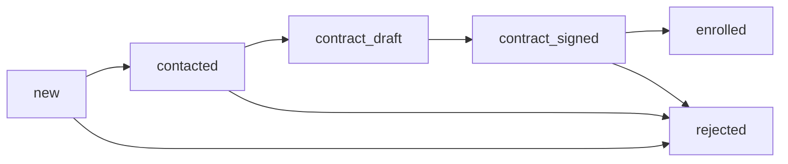

# Модуль — Абитуриенты и договоры

> [!info] Назначение
> Воронка приёма абитуриентов, создание и подписание договоров. Основной рабочий инструмент менеджера.

## Сущности

- **Applicant** — ФИО, контакты, СНИЛС, паспорт, статус воронки, `manager_id`
- **Contract** — номер, шаблон, PDF/файл, статус подписания, даты
- **Manager** — профиль менеджера, привязка к `user_id`

## Воронка статусов

## API

| Метод | Путь | Роль |
|-------|------|------|
| GET/POST | `/api/applicants` | manager, admin |
| PATCH | `/api/applicants/{id}/status` | manager, admin |
| POST | `/api/applicants/{id}/contracts` | manager, admin |
| POST | `/api/contracts/{id}/sign` | manager, admin |
| GET | `/api/managers/dashboard` | manager, admin |

## UI (manager)

- Dashboard — сводка по воронке
- Список абитуриентов — фильтры по статусу и менеджеру
- Карточка абитуриента — история, смена статуса
- Форма договора — создание, загрузка файла, подписание

## Аудит

> [!info] Критичные действия
> Смена статуса и подписание договора записываются в `audit_logs` через `AuditService`.

## Связанные заметки

- [[Этап 04 — Модуль менеджеров]]
- [[API-справочник#Менеджеры]]
- [[Критерии готовности v1]]
