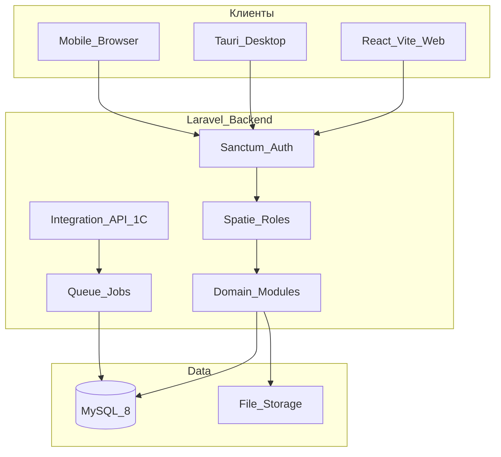
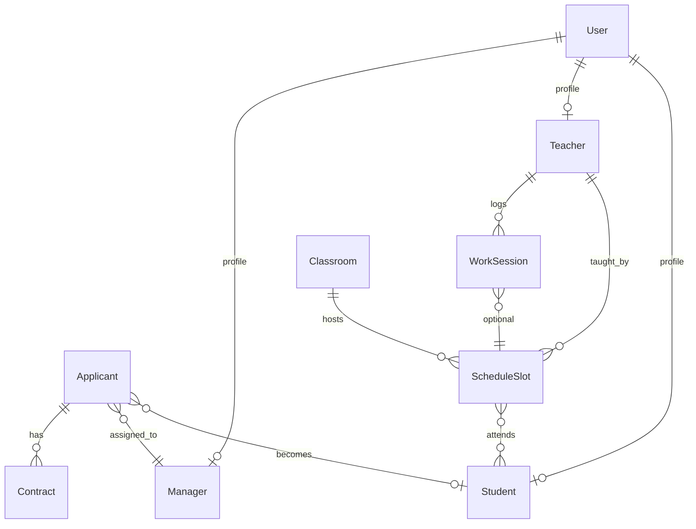

# Архитектура

> [!info] Обзор
> Monorepo: один Laravel API обслуживает web (React), mobile browser и Tauri desktop через Sanctum.

## Диаграмма

## Принципы

- **Один React-код** — web и desktop (Tauri загружает `frontend/dist`)
- **API-only backend** — Laravel без Blade, только JSON
- **RBAC** — middleware `role:*` на всех защищённых маршрутах
- **Одно учреждение** — без мультитенантности в v1

## Доменная модель

## Клиенты

| Клиент | Технология | Auth |
|--------|------------|------|
| Web | React + Vite | Sanctum cookie (SPA) |
| Mobile browser | Тот же React | Адаптивный layout |
| Desktop | Tauri 2 | Sanctum token в secure storage |

## Модули backend

| Модуль | Контроллеры |
|--------|-------------|
| Auth | `AuthController` |
| Менеджеры | `ApplicantController`, `ContractController`, `ManagerDashboardController` |
| Педагоги | `ScheduleSlotController`, `ClassroomController`, `WorkSessionController`, `TeacherController` |
| Студенты | `StudentController` |
| 1С | `IntegrationController` |
| Справочники | `ReferenceController` |

## Связанные заметки

- [[Стек]]
- [[API-справочник]]
- [[Git и репозиторий]]
- [[00-Главная]]
